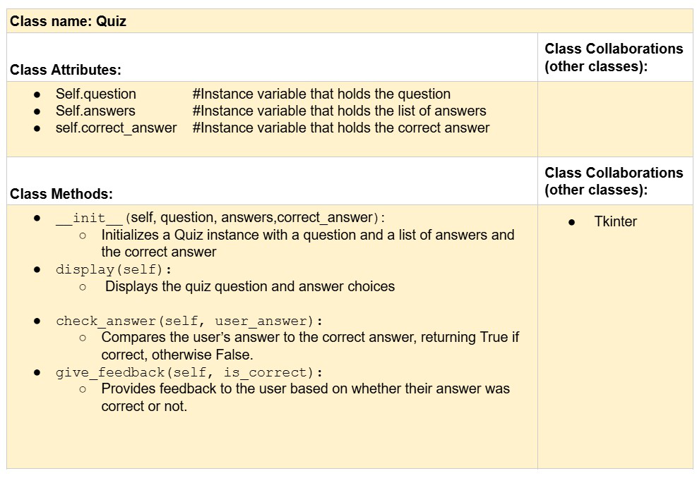

# CSC226 Final Project

## Instructions

Exclamation Marks indicate action items; you should remove these emoji as you complete/update the items which 
  they accompany. (This means that your final README should have no  ️in it!)

**Author(s)**: Arohasina Ravoahanginiaina

**Google Doc Link**: https://docs.google.com/document/d/1jGpdXDdU7qafmN9_lEAigKttqIAKwALNgQ69IkVdbLk/edit?tab=t.0

**repo link**: https://github.com/Berea-College-CSC-226/p01-final-project-arohasina

---

## References 
Throughout this project, you have likely used outside resources. Reference all ideas which are not your own, 
and describe how you integrated the ideas or code into your program. This includes online sources, people who have 
helped you, AI tools you've used, and any other resources that are not solely your own contribution. Update as you go.

-chat GPT for: encoding='utf-8' which allows the letter like "é" and "è" to display properly

-chat GPT for the method:
for widget in self.screen.winfo_children():
        widget.destroy()

winfo_children() is a method that returns a list of all the child widgets of a particular widget
and then widget.destroy() removes all widget from the screen when it transitions to a new event

-how to include a background in tkinter:
https://stackoverflow.com/questions/10158552/how-to-use-an-image-for-the-background-in-tkinter


---

## Milestone 1: Setup, Planning, Design

**Title**: `Le Flash: Level Up Your French`

**Purpose**: `Flashcards project with an interactive tool for users to study French vocabulary, phrases, and grammar
 using flashcards and quizzes.`

**Source Assignment(s)**: `HW05: Funky Functions, Fun Exams`

**CRC Card(s)**:




**Branches**: 

```
    Branch 1 name: Arohasina
    Branch 2 name: _____________
```
---

## Milestone 2: Code Setup and Issue Queue

Most importantly, keep your issue queue up to date, and focus on your code. 🙃

Reflect on what you’ve done so far. How’s it going? Are you feeling behind/ahead? What are you worried about? 
What has surprised you so far? Describe your general feelings. Be honest with yourself; this section is for you, not me.

```
So far, I feel like I have a pretty good idea of what I’m supposed to do, mostly because I spent time planning and 
breaking tasks into smaller steps. That really helped me get organized and gave me a clear direction.

But honestly, I’m still feeling a bit anxious. Even though I know what needs to be done, I’m not always sure how to 
turn those tasks into actual code.

What worries me the most is getting stuck during implementation and not knowing how to fix it. 
At the same time, I’ve been surprised by how much the planning has helped me feel less overwhelmed overall.
```

---

## Milestone 3: Virtual Check-In

Indicate what percentage of the project you have left to complete and how confident you feel. 

**Completion Percentage**: `70%`

**Confidence**: 

```
I feel relatively confident about completing the project. I had to remove some features like audio because I was 
unsure how to implement them. However, I have kept them in my issue queue for future enhancement. 
But I have managed to implement the key components of the project, such as the flashcards display,
 and now i am working on the quiz functionality, and scoring system, which I believe will meet the core requirements.

To increase the likelihood of success, I plan to keep breaking down the remaining tasks into smaller, 
manageable steps. I'll prioritize completing the quiz and final score display, 
as these are the most crucial aspects of the project. Additionally, I'll continue testing as I progress, 
identifying and resolving bugs early. 
If I encounter any issues, I will seek help from online resources, TAs or the professor. 

```

---

## Milestone 4: Final Code, Presentation, Demo

### ❗User Instructions
In a paragraph, explain how to use your program. Assume the user is starting just after they hit the "Run" button 
in PyCharm. 

### ❗Errors and Constraints
Every program has bugs or features that had to be scrapped for time. These bugs should be tracked in the issue queue. 
You should already have a few items in here from the prior weeks. Create a new issue for any undocumented errors and 
deficiencies that remain in your code. Bugs found that aren't acknowledged in the queue will be penalized.

### ❗Reflection
In three to four well-written paragraphs, address the following (at a minimum):
- Why did you select the project that you did?
- How closely did your final project reflect your initial design?
- What did you learn from this process?
- What was the hardest part of the final project?
- What would you do differently next time, knowing what you know now?
- (For partners) How well did you work with your partner? What made it go well? What made it challenging?